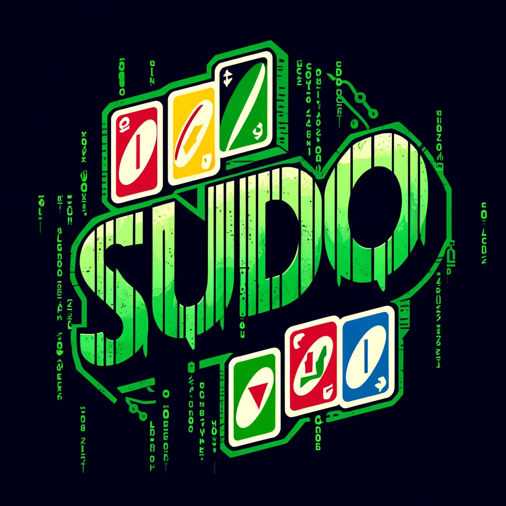
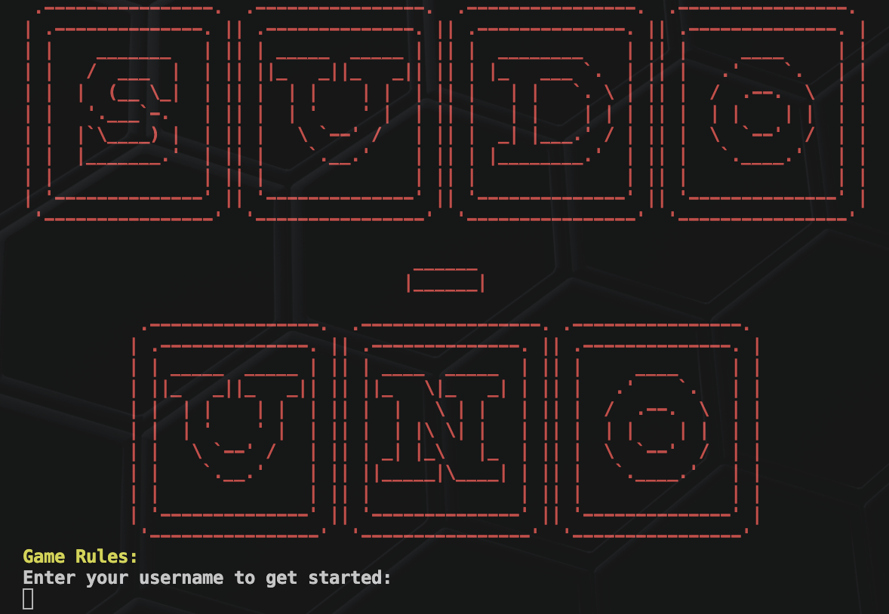
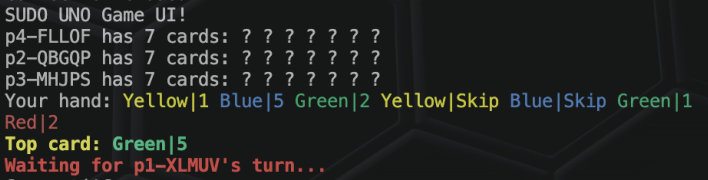
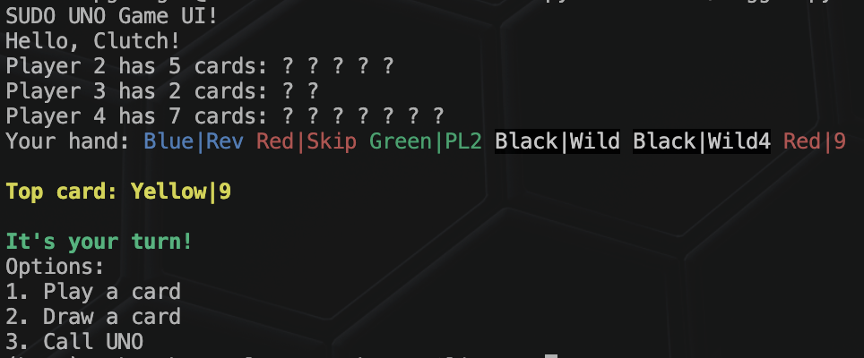

<p align="center">
    <a href="https://github.com/RaddedMC/sudo-uno">
        
    </a>
</p>

# sudo-uno: Terminal-based UNO Game Server

[](URL_TO_BUILD_STATUS) 
[](URL_TO_LICENSE)
[](URL_TO_PROJECT_VERSION)

> Dive into the classic card game UNO like never before! sudo-uno brings the joy of UNO to your terminal, allowing you to play with friends across a robust, multi-threaded server. No GUI? No problem. Experience UNO in a fresh, stylized terminal client.

## 🎮 Quick Start
This application does **not** require root access.

1. Clone the repository:
```bash
git clone https://github.com/RaddedMC/sudo-uno.git
```
2. Navigate to the project directory:
```bash
cd sudo-uno
```
3. Run the server (UNIX environment):
```bash
./server_start.sh
```
4. Open a new terminal window and start the client:
```bash
python3 client.py
```

## 📸 Screenshots

### Intro Screen:
<p align="center">
    <a href="https://github.com/RaddedMC/sudo-uno">
        
    </a>
</p>

### Waiting for Turn:
<p align="center">
    <a href="https://github.com/RaddedMC/sudo-uno">
        
    </a>
</p>

### Your Turn:
<p align="center">
    <a href="https://github.com/RaddedMC/sudo-uno">
        
    </a>
</p>

## 🎥 Demo

 <!-- Placeholder for video demo thumbnail and link -->

## ✨ Features

- **Multi-User Support:** Play UNO with friends or AI in a multi-threaded server environment.
- **Custom TCP Protocol:** Designed for efficient, real-time gameplay.
- **Stylized Terminal Client:** A clean, retro interface for the modern gamer.
- **Error Handling & Logging:** Comprehensive logging and error handling for a seamless experience.

## 🔧 Setup Instructions

Detailed setup instructions are provided for both server and client in the documentation. Ensure you follow these to get sudo-uno up and running on your system.

- [Server Setup](https://docs.google.com/document/d/1D6nZBmPCcTYNuQuhGwmPKS6JeCWb1iTyJ1TUG9PHjhE/edit#heading=h.7venikefflcz)
- [Client Setup](https://docs.google.com/document/d/1D6nZBmPCcTYNuQuhGwmPKS6JeCWb1iTyJ1TUG9PHjhE/edit#heading=h.7venikefflcz)

## 🛠 Built With

- C++ (Server)
- Python (Client)
- Custom sudo-uno TCP protocol

## 📖 Documentation

Explore the detailed documentation for an in-depth understanding of sudo-uno's architecture, setup, and gameplay.

- [Design Documentation](https://docs.google.com/document/d/1D6nZBmPCcTYNuQuhGwmPKS6JeCWb1iTyJ1TUG9PHjhE/edit#heading=h.7venikefflcz)
- [API Reference](path/to/api_reference.md)

## 🤝 Contributing

Contribution are what makes the open-source community such an amazing place to learn, inspire, and create. Any contributions you make are **greatly appreciated**.

Please refer to our [Contribution Guidelines](CONTRIBUTING.md) for more information.

## 📝 License

Distributed under the UWO License. See `LICENSE` for more information.

## 🙏 Acknowledgments

- [James Nicholls](https://github.com/RaddedMC), [Dylan Abbinett](https://github.com/dabbinet), [Paul Gherghel](https://github.com/ClutchForce), [Lukas Adie](https://github.com/lukadd16), [Pratik Gupta](https://github.com/pratikngupta), and [Kelsey Kloosterman](https://github.com/KelseyKloosterman) for their invaluable contributions to the project.
